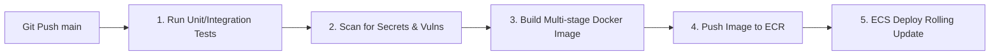

# Análisis Profundo (Deep Dive): DevOps en Aplicaciones de Trading con Binance

Felipe, en esta guía profundizaremos en los aspectos técnicos, de seguridad, arquitectura de red y observabilidad que debes dominar e implementar para un sistema de trading automatizado con la API de Binance.

---

## 1. SEGURIDAD EXTREMA Y GESTIÓN DE SECRETOS
El riesgo en aplicaciones de trading no es solo que la app se caiga, sino que alguien robe las credenciales y vacíe los fondos de la empresa.

### A. Inyección de Secretos Segura (Runtime Secrets Injection)
*   **El antipatrón:** Guardar las llaves `BINANCE_API_KEY` y `BINANCE_API_SECRET` en archivos `.env` o en el disco del servidor. Si un atacante vulnera la app por una inyección de código o un fallo de biblioteca, puede leer los archivos del disco.
*   **La solución DevOps:** Usar un servicio administrado como **AWS Secrets Manager** o **HashiCorp Vault**.
    *   Durante el arranque del contenedor (ej: en ECS Fargate o Kubernetes), la plataforma de contenedores realiza una llamada a la API de Secrets Manager, obtiene las llaves y las inyecta **únicamente como variables de entorno en la memoria RAM** del proceso del contenedor.
    *   El disco duro del servidor nunca almacena las credenciales.

### B. Principio del Menor Privilegio (Least Privilege)
Al crear las API Keys en Binance, debes restringir estrictamente sus capacidades:
*   **Entorno Dev/Staging:** Usar únicamente credenciales generadas en la **Binance Testnet** (dinero de mentira).
*   **Entorno Prod:**
    *   **Enable Reading:** Activado (para ver balances y precios).
    *   **Enable Spot/Margin Trading:** Activado (para operar).
    *   **Enable Withdrawals:** **DESACTIVADO** (Deshabilitado). Si el sistema llega a ser vulnerado, el atacante podrá hacer operaciones absurdas, pero no podrá transferirse las criptomonedas a una billetera externa.

### C. Whitelisting de IPs (Lista Blanca)
*   Binance permite restringir el uso de una API Key a direcciones IP específicas.
*   Como DevOps, debes proveer al servidor de trading una **IP elástica (estática)** o pasar el tráfico saliente a través de un **NAT Gateway** con una IP fija.
*   Esa IP estática de producción se registra en la consola de Binance. Si alguien roba las credenciales de producción, no podrá usarlas desde otra máquina porque Binance rechazará cualquier petición que no venga de la IP de tu servidor.

---

## 2. ARQUITECTURA DE RED Y BAJA LATENCIA
En trading de alta frecuencia o algorítmico, un retraso de 100 milisegundos puede significar entrar a un precio desfavorable (Slippage).

### A. Ubicación Geográfica (Co-location)
*   Los servidores de la API de Binance están alojados principalmente en AWS en la región de **Tokio (ap-northeast-1)**.
*   Si tus servidores están en EE. UU. (us-east-1), cada petición HTTP debe cruzar el Océano Pacífico, añadiendo una latencia de red base de **120ms a 180ms**.
*   **La Solución:** Tu Terraform debe desplegar la infraestructura del bot de trading en **ap-northeast-1 (Tokio)**. La latencia de red interna dentro de los centros de datos de AWS en Tokio hacia los endpoints de Binance se reduce a **1ms - 5ms**.

### B. WebSocket vs. REST API
*   **REST API (HTTP):** Consume muchos recursos y tiempo debido al *handshake* TCP/SSL de cada petición. Se usa únicamente para **escribir** (enviar órdenes de compra/venta).
*   **WebSockets (WSS):** Mantiene una única conexión TCP bidireccional abierta de forma persistente. Se usa para **leer datos de mercado** (precios en tiempo real, libro de órdenes) y para recibir actualizaciones del estado de las órdenes del bot. 
*   **Rol DevOps:** Debes asegurar que los proxies (Nginx) y balanceadores de carga soporten conexiones de larga duración (WebSockets) sin cerrarlas por inactividad (*idle timeouts* configurados en más de 3600 segundos).

---

## 3. MONITOREO Y OBSERVABILIDAD ESPECÍFICA DE TRADING
Los sistemas de monitoreo tradicionales vigilan CPU y RAM. En trading, eso no es suficiente.

### A. Monitoreo de Rate Limits (Límites de Peticiones)
*   Binance limita las peticiones por IP (ej: 1200 "pesos" de solicitud por minuto). Si te pasas, recibes un error **HTTP 429** y posteriormente un baneo de IP temporal (HTTP 418).
*   Binance responde en cada cabecera HTTP con el consumo actual:
    *   `x-mbx-used-weight-1m`: Peso acumulado consumido en el último minuto.
*   **Tu tarea DevOps:** El equipo de desarrollo debe exportar esta cabecera como una métrica de Prometheus. Tú configuras un panel en Grafana y una alerta en **Alertmanager** que se dispare si el consumo de peso supera el 85% del límite, advirtiendo al equipo antes de que ocurra un baneo de IP que detenga las operaciones de producción.

### B. Métricas de Negocio y Salud de los Procesos
Debes configurar alertas en Prometheus/Alertmanager para los siguientes escenarios:
*   **Bot Lag / Heartbeat:** Si el bot de trading no envía una señal de "estoy vivo" (heartbeat) a Redis o Prometheus en 30 segundos, mandar una alerta crítica por Telegram/Slack.
*   **Errores de Conexión:** Alertar si el porcentaje de errores de red o timeouts contra los servidores de Binance supera el 2%.
*   **Balance Mínimo:** Monitorear el balance en BNB (usado para pagar comisiones en Binance) o en la moneda base (USDT/USDC). Si cae por debajo de cierto límite, alertar para recargar la cuenta.

---

## 4. PIPELINE DE CI/CD PARA BOT DE TRADING
El flujo para actualizar el código debe ser súper seguro y veloz.

1.  **Tests de Integración (Mocking):** El pipeline de CI debe ejecutar pruebas unitarias simulando las respuestas de Binance utilizando librerías de *mocking* para no tocar la API real de Binance en cada compilación.
2.  **Estrategia de Despliegue (Rolling Update):**
    *   En aplicaciones web tradicionales se usa *Blue/Green Deployments* o *Canary*.
    *   En bots de trading con WebSockets, debes programar un **Graceful Shutdown** (Apagado ordenado): cuando liberes una versión nueva, el bot viejo debe dejar de tomar nuevas órdenes, esperar a que las órdenes abiertas se completen o cancelen, cerrar la conexión de WebSocket limpiamente, y luego dejar que el nuevo contenedor tome el control.
