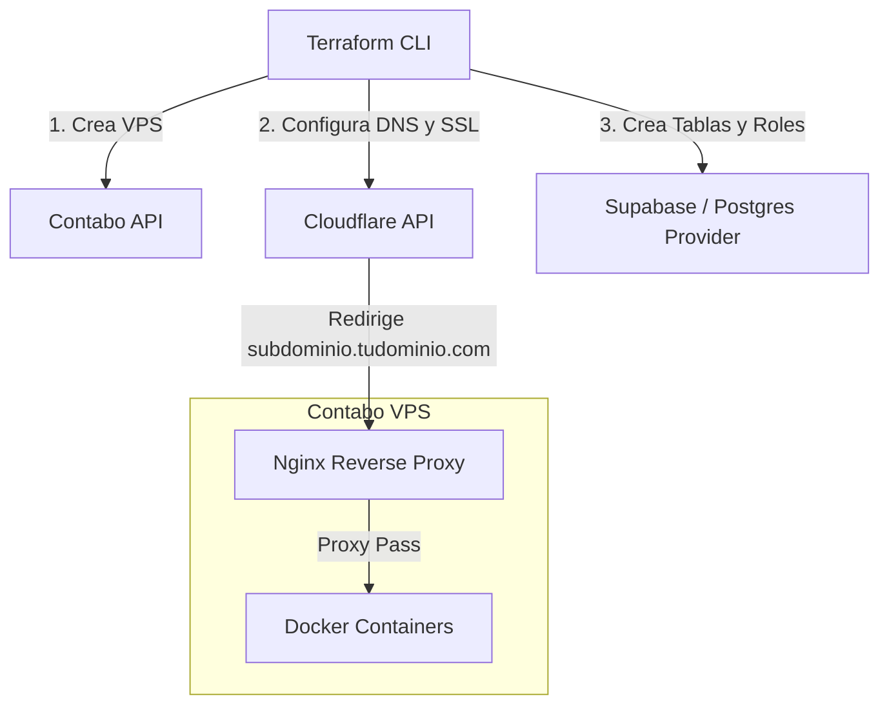

# Arquitectura IaC para tu Stack Actual (Contabo + Cloudflare + Supabase)

Felipe, la respuesta corta es: **Sí, absolutamente**. De hecho, esta es una excelente idea para tu portafolio, ya que demuestra que sabes aplicar **Infraestructura como Código (IaC)** en escenarios del mundo real fuera de AWS.

Terraform es una herramienta **multi-cloud**. No está atada a AWS; funciona con cualquier servicio que tenga una API pública mediante el uso de **Providers**.

---

## 1. Arquitectura de Infraestructura en Código

Aquí tienes cómo interactúa Terraform con cada componente de tu stack:



---

## 2. Los Proveedores (Providers) que usarías

Para tu stack, declararías estos proveedores en tu archivo de Terraform:

```hcl
terraform {
  required_providers {
    cloudflare = {
      source  = "cloudflare/cloudflare"
      version = "~> 4.0"
    }
    contabo = {
      source  = "contabo/contabo"
      version = "~> 0.1" # Proveedor de la comunidad de Contabo
    }
    postgresql = {
      source  = "cyrilgdn/postgresql"
      version = "~> 1.19" # Para gestionar roles/tablas en Supabase
    }
  }
}
```

---

## 3. Ejemplo de Código Práctico (`main.tf`)

Aquí tienes un boceto de cómo se vería tu infraestructura declarada en un solo archivo:

```hcl
# =========================================================================
# 1. PROVISIONAR EL VPS EN CONTABO
# =========================================================================
resource "contabo_instance" "mi_servidor" {
  display_name = "vps-produccion-felipe"
  product_id   = "vps-s-ssd" # Tipo de VPS en Contabo (ej: VPS S)
  region       = "de"        # Alemania u otra región de Contabo
  image_id     = "ubuntu-22.04"
  ssh_keys     = [var.my_ssh_key_id]
}

# =========================================================================
# 2. CONFIGURAR CLOUDFLARE (DNS y Seguridad)
# =========================================================================
# Apuntar tu subdominio (ej: api.felipebotero.com) al VPS de Contabo
resource "cloudflare_record" "api_subdomain" {
  zone_id = var.cloudflare_zone_id # ID de tu dominio en Cloudflare
  name    = "api"                  # "api" para crear api.tudominio.com
  value   = contabo_instance.mi_servidor.ip_address # Toma la IP del VPS dinámicamente
  type    = "A"
  proxied = true # Activa el CDN, DDoS protection y SSL de Cloudflare
}

# =========================================================================
# 3. GESTIONAR LA BASE DE DATOS EN SUPABASE
# =========================================================================
# Supabase te da una cadena de conexión Postgres. Puedes usar el proveedor
# de Postgres para automatizar la creación de tablas o esquemas para tu app.
provider "postgresql" {
  host     = "db.xxxxxx.supabase.co"
  port     = 5432
  database = "postgres"
  username = "postgres"
  password = var.supabase_db_password
  sslmode  = "require"
}

resource "postgresql_schema" "app_schema" {
  name = "app_shipments"
}
```

---

## 4. ¿Y qué pasa con Nginx y los Subdominios internos?

Terraform es excelente para **aprovisionar** (crear el VPS y el DNS), pero no es la herramienta ideal para configurar el software dentro del VPS (es decir, escribir los archivos de configuración de Nginx y recargar el servicio). 

Para **Nginx y tus contenedores Docker**, la mejor práctica es combinar Terraform con:

1.  **Ansible (Recomendado):**
    Una vez que Terraform crea el VPS y te da la dirección IP, ejecutas un Playbook de Ansible que se conecta por SSH al VPS, instala Docker, instala Nginx, y escribe los bloques de configuración de tus subdominios (`server_name api.felipebotero.com; proxy_pass http://localhost:3000`).
2.  **Cloud-init (User Data):**
    Puedes pasarle a la propiedad `user_data` de Contabo un script en Bash que instale y configure Nginx automáticamente al encender el servidor por primera vez.

---

## 5. Beneficios para tu Carrera y Portafolio

Implementar esto en tu portafolio personal tiene un valor altísimo para las empresas:
*   **Ahorro de costos:** Demuestras que sabes desplegar arquitecturas modernas usando proveedores económicos como Contabo en lugar de servicios costosos de AWS/GCP.
*   **Automatización de DNS:** Evitas tener que entrar manualmente a la interfaz web de Cloudflare a crear registros "A" cada vez que creas un subdominio. Todo queda documentado en código.
*   **Control de cambios:** Si quieres cambiar un subdominio o añadir uno nuevo, solo cambias el archivo `.tf`, haces `git commit`, y se despliega solo.
